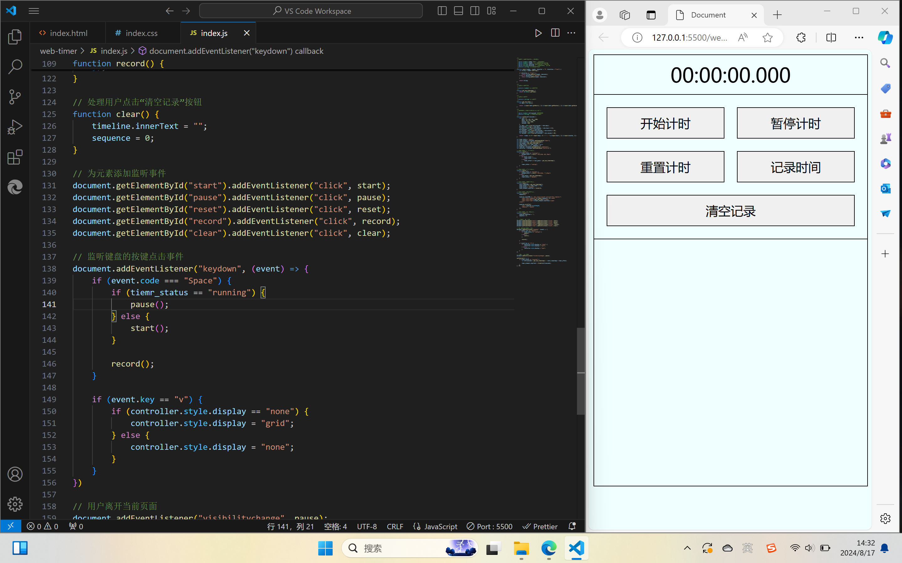

一个运行在浏览器上的，使用纯原生JavaScript代码实现的计时器，有开始、暂停、重置、timeline、清除timeline列表的功能。
键盘快捷键：
单击“空格”即可暂停或者开始计时，同时也会生成一个timeline
单击“v”即可隐藏或者显示计时器控制器
单击“d”即可设置alert是否弹出

注：单击timeline即可删除该timeline

页面+代码快照：

完成日期：2024/08/17 15:06:56